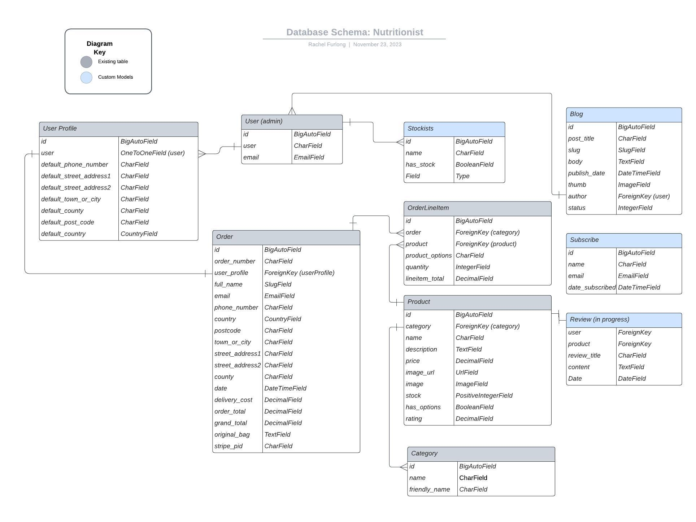

<h1 align="center">The Nutritionist Website</h1>

[View the live project here.](https://nutritionist-rf-f7d23ec1a841.herokuapp.com/)

This is the main marketing website for The Nutritionist raw organic online food store. It is designed to be responsive and accessible on a range of devices, making it easy to navigate for potential customers and users.

<h2 align="center"></h2>

## TABLE OF CONTENTS

* [User Experience](#user-experience)
    * [User Stories](#user-stories)
* [Design](#design)    
    * [Typography](#typography)
    * [Colour Scheme](#colour-scheme)
    * [Wireframes](#wireframes)
* [Database Design](#database-design)
    * [Relational Database](#relational-database)
    * [Entity Relationship Diagram](#entity-relationship-diagram)
* [Models](#models)
    * [Custom Models](#custom-models)
* [Features](#features)
* [Technologies Used](#technologies-used)
    * [Front End Technologies](#front-end-technologies)
    * [Back End Technologies](#back-end-technologies)
    * [Additional Technologies](#additional-technologies)
* [Deployment](#deployment)
    * [ElephantSQL](#elephantsql)
    * [Heroku](#heroku)
    * [Deploying to Heroku](#deploying-to-heroku)  
    * [Stripe](#stripe) 
    * [Amazon Web Services](#amazon-web-services)  
* [Credits](#credits)
    * [Code](#code) 
    * [Content](#content)
    * [Media](#media) 
    * [Acknowledgements](#acknowledgements)     

## User Experience (UX)

-   ### User stories

    -   #### First Time Customer Goals

        1. As a First Time Customer, I want to easily understand the main products sold by the ecommerce company
        2. As a First Time Customer, I want to be able to easily navigate throughout the site to find products.
        3. As a First Time Customer, I want to look for reviewss to understand what their customers think of them and see if they are trusted and provide a good level of service. I also want to locate their social media links to see their followings on social media to determine how trusted and known they are.

    -   #### Returning Customer Goals

        1. As a Returning Customer, I want to explore and find new and inspiring dried fruit and nuts to buy.
        2. As a Returning Customer, I want to be able to buy products form the store and get them delivered.
        3. As a Returning Customer, I want to be able to find out more about the nutritional benefits of the products the store sells.

    -   #### Frequent Customer Goals
        1. As a Frequent Customer, I want to be able to find products easily through search options.
        2. As a Frequent Customer, I want to sign up and create my own account.
        3. As a Frequent Customer, I want to sign up to the Newsletter so that I am emailed information about any new products.

    -   #### Site Owner Goals
        1. As a Site Owner, I want the website to be attractive to customers and entice them to buy products easily.
        2. As a Site Owner, I want to establish a reular customer base who return and make regular purchases.
        3. As a Site Owner, I want products to be stocked in high street shops and keep track of stock held by partners.

## Design:

### Typography
 The Poppins font via [Google Fonts:](https://fonts.google.com/) is the main font used throughout the website with Sans Serif as the fallback font in case for any reason the font cannot be displayed in a browser correctly.

### Color Scheme:

*Palette*: **The Nutritionist**

| Brand colour | Black |
| :---: | :---: |
|  |  |
| #00474C | #000000 |  

### Wireframes
I have drawn a series of wireframes using Adobe XD to evidence responsive design planning of the site taking into account layouts for a range of device sizes (mobile, tablet and desktop views) When the mobile layout differers significantly from tablet, I have drawn an additional layout - for example the products page layout. You can see the wireframes for the product page below. For the complete set of wireframes - the files are stored [here](media/wireframes/).

### Wireframes - mobile first design
#### Mobile layout (products)

#### Tablet layout (products)

#### Desktop layout (products)

## Database
### Relational Database
This project utilises PostgreSQL, a relational database mangement system (RDBMS) managed by ElephantSQL which offers PostgreSQL as a service. 

### Entity Relationship Diagram
As illustrated in the ERD, each model corresponds to a database table, and each field corresponds to a column in that table.

## Models
Django includes an Object-Relational Mapping (ORM) system for working with databases. In Django, a "model" refers to a Python class that defines the structure and behaviour of a database table. Models can establish relationships with other models, such as ForeignKey, OneToOneField, and ManyToManyField, to represent associations between tables in the database.

### Custom Models
The following are the custom built models for this app:

#### Blog:
The blog has functionality to add a series of posts with title, text excerpt and an image displayed on the main blog page, with a button to click through to read the whole content of the post.

#### Post Model Database Table
- id: BigAutoField
- post_title : Charfield
- slug: Slugfield
- body : Textfield
- publish_date: DateTimeField
- thumb: ImageField
- author: ForeignKey
- status: IntegerField

The Post Model also has a nested class Meta, which orders the posts in descending order according to the publish_date field. The __str__ method returns the title of the blog post as a string, so the title of each blog is listed in the admin area. 

### Stockists:
A model designed to store information added by the owner (superuser) of the ecommerce site, to lbe able to check which retailers have the company's products in stock. 

#### Stockists Model Database Table
- id: BigAutoField
- name : Charfield
- has_stock: BooleanField

#### Subscribe Model Database Table
- id: BigAutoField
- name : Charfield
- email: EmailField
- date_subscribed: DateTimeField

### Reviews:
The Reviews model and templates are currently in development.

## Features

#### Main site features
Clear navigation for user to select relevant page.
A strapline promoting free delivery over an indicated amount.
Bag modal with bag contents and total on product pages. 
Allauth utilised for profile account features, allowing to  save address information and  order history.
Responsive on all device sizes.
A footer has been added to selected pages, with company social links to social media sites. The footer will be developed in the future to include additional navigation  links to internal pages.

#### Home App
The navigation allows users to select products, blog, checkout and profile pages. Navigation also has a Search bar and Menu dropdowns to sort products into price, category or by rating.
Hero image and main strapline provides information about the brand and its purpose.
Footer with social icons to the brand’s Pinterest and Instagram pages and copyright statement. The footer will be developed into a section containing links to all pages, terms and conditions and cookies statement.

#### Product App
Item_list [CRUD]
Select products of in a specific category (Nuts, seeds, mixes fruits & berries or coated fruit.
Sort the products by price, rating or category and add products to the bag - view the total cost of item in the modal box.
Products page layout shows the images of the various products, name, price, category and star rating.
Product detail pages allow the user to find out more about the product, add a product to the bag and increase or decrease the number of products selected. Users can redirect to the shopping page to view additional products to buy. Additional JavaScript code ensures that the decrement button is disabled from going below one item.
On adding the item to the bag, a user sees an automated popup with a Toast message providing feedback to the user confirming the action was successful and how many of that product were added to the bag. The user can also see a list of previous products if they have already been added to the bag, together with an image, description, total price, and a button to go to the checkout page for payment.

#### Bag App
The product summary page provides a list of products selected for purchase with options to increase or decrease the number of items in the bag, or to delete if required via a remove link.
Users can view delivery costs at this point and are advised of how much more spend is required to reach the minimum spend for free delivery as well as delivery costs if the user does not want to increase spend. 
User can proceed to complete purchase via a button stating ‘secure checkout’

#### Checkout App
- To complete the purchase, users complete the form with their delivery and payment details, and click the ‘complete order’ button to finalise. (The user, right to the final action still has the opportunity to adjust the bag contents. If users go ahead with the purchase they are informed for the total amount that will be charged to their card in advance.
- Payments are made via the Stripe payment solution integrated with the app..
A bag session is stored in the database with order details added to the order table 
- Users can save their order details, so then the database is updated with their profile linked to their order. Users on subsequent logins can view their previous orders in order history on their profile page.
- Users receive an email to their inbox to confirm their order and are provided with  the order number. 

#### Sign-up/Login
- The sign-in page allows users to log into their account by filling a username and a password field correctly. If the user has forgotten their password there is a link to the reset password page as well as links to return to the Home page if required.
- Annonymous users can sign up for an account by adding their email address and setting their passwords in the relevant fields. Toasts keep users informed if thier login has been successful. 
- New customers receive an email to their inbox requesting them to click a link to verify their account to complete sign-up.

#### Admin features:
CRUD functionality
Django @login_required decorator provides protection against anonymous users or users without superuser permissions accessing the data store. Superusers are permitted to Add, Edit and Delete products on the Product Management page on login. 

#### Add Product
There is a form on the product management allowing staff to complete the necessary fields. Category, Sku, Name, Description, Options, Price, rating and Image url. Some fields are optional as indicated by an asterisk next to their name. If no image is selected then a default image is used instead.

#### Edit Product 
Admin superusers can go to an existing product on the product page and use the edit link to provide access to the edit product functionality. There is a Toast feedback modal to alert supersuers to the fact they are editing a product. The details of a product can be amended as required and then updated or removed.

#### Delete Product
Admin superusers can go to an existing product on the product page and use the delete link which on click removes a product immediately, with a feedback popup (Toast) to confirm deletion was successful.

#### Blog App
**Blog Archive page / Blog detail page:**
Posts display an image, an excerpt and a button, and the posts are sorted in date order so the latest published blog is at the top. A button takes the user to the post detail page where all the text and an image are displayed. There is also a button to return the user to the blog archive page.

#### Stockists App
Admins are permitted to edit the stockist list in the admin area so that offline stores who stock items supplied by The Nutritionist can be listed. An owner can maintain an up-to-date list of stockists so that users will be able to view which companies stock products.Users can view instock items at online stores via the link in the footer.  

#### Subscribe App
Unregistered and registered users can sign up to be added to The Nutritionist mailing list. The user signs up and sees a success message if the sign up is successful. The records are saved in the admin area with name, date and date subscribed listed.There are messages that warn the user if the email is invalid or a field is missing.

#### Future Features
- A reviews app is currently in development so that customers will be able to addd reviews to individual  products.
- The stockists app could be developed so customers can see if a shop near their location stocks items. In addition, the app could link to an inventory to indicate individual items in stock/out of stock. In time the app would be more prominent on the front end as its use to customers develops.
- Additional columns will be added to the footer section allowing for the addition of a footer nav bar including links to a Terms and Conditions and a Cookies page. Columns can be used for a newsletter sign-up and any industry award badges the store owner may want to display.
- Additional content on the home page with featured or new products promoted beneath the hero section.

## Technologies Used

### Front-End Technologies

- 
    - [HTML5](https://developer.mozilla.org/en-US/docs/Web/Guide/HTML/HTML5) - Used as the base for markup text.
- 
    - [CSS3](https://developer.mozilla.org/en-US/docs/Web/CSS/CSS3) - Used as the base for cascading styles.
- 
    - [jQuery 3.4.1](https://code.jquery.com/jquery/) - Used as the primary JavaScript functionality.
- 
    - [Bootstrap 4.6](https://getbootstrap.com/docs/4.6/getting-started/introduction/) - Used as the front-end framework for layout and design.
- 
    - [Stripe API](https://stripe.com/docs/api?lang=python) - Used to make secured payments on *The Nutritionist*.
- 
    - [Amazon AWS S3](https://aws.amazon.com/) - Used to store *staticfiles* and *media* folders and files.

### Back-End Technologies

- 
    - [Python 3.6.7](https://www.python.org/) - Used as the back-end programming language.
- 
    - [Django 2.2.16](https://docs.djangoproject.com/en/2.2/) - Used as my Python web framework.
- 
    - [Heroku](https://www.heroku.com) - Used for *"Platform as a Service"* (PaaS) for app hosting.
- 
    - [PostgreSQL 11.4](https://www.postgresql.org/) - Used as relational SQL database via [ElephantSQL](https://www.elephantsql.com/).

### Additional Technologies

1. [Google Fonts:](https://fonts.google.com/)
    - Google fonts were used to import the 'Poppins' font used on all pages throughout the project.
1. [Font Awesome:](https://fontawesome.com/)
    - Font Awesome was used on all pages throughout the website to add icons for aesthetic and UX purposes.
1. [Photoshop:](https://www.adobe.com/ie/products/photoshop.html)
    - Photoshop was used to resize images and editing photos for the website.
1. [Adobe XD:](https://en.wikipedia.org/wiki/Adobe_XD)
    - Adobe XD was used to create the [wireframes](media/wireframes/) during the design process. 
1. [Git](https://git-scm.com/)
    - Git was used for version control by utilizing the Gitpod terminal to commit to Git and Push to GitHub.
1. [GitHub:](https://github.com/)
    - GitHub was used to store the projects code after being pushed from Git.

## Deployment

The project was deployed to Heroku and uses a relational PostgreSQl database via ElephantSQL using the following steps...

### ElephantSQL

1. Go to [ElephantSQL.com](https://www.elephantsql.com/) and click *Get a managed database today*.
2. Choose New, then from the dropdown, select *Create new app*
3. Add preferred app name, select location, then click *create app* 
4. Select Tiny Turtle via *Try now for FREE*
5. Select *Log in with GitHub* and authorize ElephantSQL with your GitHub account.
6. In the create new team form:
7. Add a *team name*. 
8. Agree to the *Terms of Service*.
9. Select *Yes* for GDPR.
10. Add email address.
11. Click *Create Team*.
12. Click *Create New Instance*.

After logging into ElephantSQL...
1. Set up your plan.
2. Name the plan (genrally the name of the project).
3. Select a region and data center (the one closest to your area).
4. Click *Review*.
5. Click *Create New Instance*.
6. Return to the dashboard and click on the *database instance name*.
7. Copy the database url.

### Heroku

1. Go to [Heroku.com](https://www.heroku.com/).
2. Choose *New*, then from the dropdown, select *Create new app*
3. Add preferred app name, select location, then click *create app* 
4. Go to the settings tab and add the DATABASE_URL config var.   
5. Select *Reveal Config Vars*.
6. Add config var DATABASE_URL and paste in the ElephantSQL database URL as the value.
7. Add config var DATABASE_URL and paste in the ElephantSQL database URL as the value.
8. Connect external database to GitPod as follows:
9. In the **env.py** file add a new key, **DATABASE_URL** then give it the value of the database URL (see config vars Heroku).
10. Install **dj-database-url** package version 0.5.0 and **psycopg2** in the terminal.
11. Type *pip3 freeze --local > requirements.txt* to add the packages to the requirements.txt file.
12. In settings.py file, comment out the default database setting and replace with the DATABASE_URL environment variable.
13. Run *showmigrations* command in the terminal in order to confirm connection to the external database and view the list of migrations which should have been made, then run the *migrate* command.
14. Create a superuser for the new database.

### Deploying to Heroku

1. Install gunicorn which will act as our webserver and freeze that into the requirements.txt file
2. Create a Procfile in the root directory to tell Heroku to create a web dyno which will run gunicorn and serve our Django app.
3. Temporarily disable collectstatic by logging into the Heroku CLI in the terminal to tell Heroku not to collect static files when deploying:
4. Add the hostname of our Heroku app to allowed hosts in settings.py.
5. Commit changes and push to GitHub.
6. Use the command *git push Heroku main* to deploy to Heroku.

### Stripe

### Amazon Web Services

## Credits
[Tim Nelson](https://github.com/TravelTimN/ci-milestone05-fsfw/blob/main/README.md?plain=1) - icons for technologies used in Readme.md

### Code

-   [Bootstrap4](https://getbootstrap.com/docs/4.4/getting-started/introduction/): Bootstrap Library used throughout the project mainly to make site responsive using the Bootstrap Grid System.
- Tutorial by [DjangoCentral](https://djangocentral.com/building-a-blog-application-with-django/) for help with blog development.

- Tutorial by [Python Lessons](https://www.youtube.com/watch?v=wl4Yxo5_Cgw) for help with newsletter sign up development.

### Content

-   All content was written by the developer.

### Media

-   All product images were created by the developer

### Acknowledgements

-   My Mentor Tim Nelson for continuous helpful feedback.

-   Martin at Code Institute Tutor Support for help with coding errors..