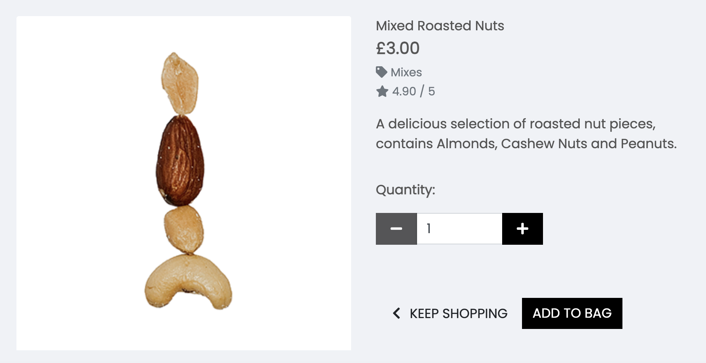

<h1 align="center">The Nutritionist Website</h1>

[View the live project here.](https://nutritionist-rf-f7d23ec1a841.herokuapp.com/)

This is the main marketing website for The Nutritionist raw organiic online food store. It is designed to be responsive and accessible on a range of devices, making it easy to navigate for potential customers and users.

<h2 align="center"></h2>

## User Experience (UX)

-   ### User stories

    -   #### First Time Visitor Goals

        1. As a First Time Visitor, I want to easily understand the main products sold by the ecommerce company
        2. As a First Time Visitor, I want to be able to easily navigate throughout the site to find products.
        3. As a First Time Visitor, I want to look for reviewss to understand what their customers think of them and see if they are trusted and provide a good level of service. I also want to locate their social media links to see their followings on social media to determine how trusted and known they are.

    -   #### Returning Visitor Goals

        1. As a Returning Visitor, I want to explore and find new and inspiring dried fruit and nuts to buy.
        2. As a Returning Visitor, I want to be able to buy products form the store and get them delivered.
        3. As a Returning Visitor, I want to be able to find out more about the nutritional benefits of the products the store sells.

    -   #### Frequent User Goals
        1. As a Frequent User, I want to be able to find products easily through search options.
        2. As a Frequent User, I want to sign up and create my own account.
        3. As a Frequent User, I want to sign up to the Newsletter so that I am emailed information about any new products.

-   ### Design
    -   #### Colour Scheme
        -   The two main colours used are Code Insititue red, and white.
    -   #### Typography
        -   The Poppins font is the main font used throughout the whole website with Sans Serif as the fallback font in case for any reason the font isn't being imported into the site correctly. Montserrat is a clean font used frequently in programming, so it is both attractive and appropriate.
    -   #### Imagery
        -   Imagery is important. The large, background hero image is designed to be striking and catch the user's attention. The product images have a cohesive and modern, fresh aesthetic.

*   ### Wireframes

    -   Home Page Wireframe - [View](https://github.com/)

    -   Mobile Wireframe - [View](https://github.com/)

    -   Contact Us Page Wireframe - [View](https://github.com/)

## Database
### Relational Database
This project utilises PostgreSQL, a relational database mangement system (RDBMS) managed by ElephantSQL which offers PostgreSQL as a service. 

### Models
Django includes an Object-Relational Mapping (ORM) system for working with databases. In Django, a "model" refers to a Python class that defines the structure and behaviour of a database table. Models can establish relationships with other models, such as ForeignKey, OneToOneField, and ManyToManyField, to represent associations between tables in the database.

As illustrated in the ERD, each model corresponds to a database table, and each field corresponds to a column in that table.

### Entity Relationship Diagram (ERD)


The following are the custom built models for this app:

### Blog:
The blog has functioinality to add a series of posts displayed on the main blog page, with a button to click through to read the whole content of the post.

#### Post Model Database Table
- id: BigAutoField
- post_title : Charfield
- slug: Slugfield
- body : Textfield
- publish_date: DateTimeField
- thumb: ImageField
- author: ForeignKey
- status: IntegerField

The Post Model also has a nested class Meta, which orders the posts in descending order according to the publish_date field. The __str__ method returns the title of the blog post as a string, so the title of each blog is listed in the admin area. 

### Stockists:
A simple model designed to store information added by the owner (superuser) of the ecommerce site, to list which retailers have the company's products in stock. 

#### Stockists Model Database Table
- id: BigAutoField
- name : Charfield
- has_stock: BooleanField

### Reviews:
id: BigAutoField
username : Charfield
email: EmailField
UserProfile 


## Features

-   Responsive on all device sizes

-   Interactive elements

## Technologies Used

### Languages Used

-   [HTML5](https://en.wikipedia.org/wiki/HTML5)
-   [CSS3](https://en.wikipedia.org/wiki/Cascading_Style_Sheets)

### Frameworks, Libraries & Programs Used

1. [Bootstrap 4.4.1:](https://getbootstrap.com/docs/4.4/getting-started/introduction/)
    - Bootstrap was used to assist with the responsiveness and styling of the website.
1. [Hover.css:](https://ianlunn.github.io/Hover/)
    - Hover.css was used on the Social Media icons in the footer to add the float transition while being hovered over.
1. [Google Fonts:](https://fonts.google.com/)
    - Google fonts were used to import the 'Titillium Web' font into the style.css file which is used on all pages throughout the project.
1. [Font Awesome:](https://fontawesome.com/)
    - Font Awesome was used on all pages throughout the website to add icons for aesthetic and UX purposes.
1. [jQuery:](https://jquery.com/)
    - jQuery came with Bootstrap to make the navbar responsive but was also used for the smooth scroll function in JavaScript.
1. [Git](https://git-scm.com/)
    - Git was used for version control by utilizing the Gitpod terminal to commit to Git and Push to GitHub.
1. [GitHub:](https://github.com/)
    - GitHub is used to store the projects code after being pushed from Git.
1. [Photoshop:](https://www.adobe.com/ie/products/photoshop.html)
    - Photoshop was used to create the logo, resizing images and editing photos for the website.
1. [Balsamiq:](https://balsamiq.com/)
    - Balsamiq was used to create the [wireframes](https://github.com/) during the design process.

## Testing

The W3C Markup Validator and W3C CSS Validator Services were used to validate every page of the project to ensure there were no syntax errors in the project.

-   [W3C Markup Validator](https://jigsaw.w3.org/css-validator/#validate_by_input) - [Results](https://github.com/)
-   [W3C CSS Validator](https://jigsaw.w3.org/css-validator/#validate_by_input) - [Results](https://github.com/)

### Testing User Stories from User Experience (UX) Section

-   #### First Time Visitor Goals

    1. As a First Time Visitor, I want to easily understand the main products sold by the ecommerce company

        1. Upon entering the site, users are automatically greeted with a clean and easily readable navigation bar to go to the page of their choice. Underneath there is a Hero Image with Text and a "Shop Now" Call to action button.
        2. The main visual impression of the brand is evident immediately with the hero image.

    2. As a First Time Visitor, I want to be able to easily navigate throughout the site to find products.

        1. At the top of each page there is a clean navigation bar, each link has a dropdown menu which describes what category they will end up at clearly, alternatively the left hand dropdown menu offers a selection of sort methods.
        2. Users can click on a product of interest to find out more about the product and add their chosen quantity to their basket.
        
        3. There is a Keep Shopping call to action button at the bottom of each product page to return the customer to the main product page.

    3. As a First Time Visitor, I want to look for reviews to understand what their customers think of them and see if they are trusted and provide a good level of service. I also want to locate their social media links to see their followings on social media to determine how trusted and known they are.
        1. Once the new visitor has visited individual products, the user will be able to see reviews indicating what previous buyers thought about the product.
        2. The user can also scroll to the bottom of most pages on the site to locate social media links in the footer.

-   #### Returning Visitor Goals

    1. As a Returning Visitor, I want to explore and find new and inspiring dried fruit and nuts to buy.

        1. These are clearly shown in the product layouts and individual product pages.
        2. Shoppers will be able to find out about new products when they are anounced in the blog.

    2. As a Returning Visitor, I want to be able to buy products form the store and get them delivered.

        1. The individual product pages allow users to add products to their bag.
        2. A toast message will appear to inform the user they have successfully added the product quantity to the bag.
        
        3. Users can see products listed on the shopping bag page with a total cost information on delivery threshold and a button to click through to the checkout page to purchase.
        4. Users can create an account and buy products for delivery using card payment methods.
        5. The user receives a toast message to confirm if the purchase was successful and the user will receive a confirmation emai to their email address.

    3. As a Returning Visitor, I want to be able to find out more about the nutritional benefits of the products the store sells.
        1. The Blog Page has a tab on the main navigtion and will open the main blog archive with a list of posts to read. Each post links through to the complete article on a new page.

-   #### Frequent User Goals

    1. As a Frequent User, I want to be able to find products easily through search options.

        1. The user can explore the sort methods in the drop down menu on the main navigation and sort products by price rating or category. Each sort optioin has further options such as ordering products from low - high price or alphabetically for example.
        
    2. As a Frequent User, I want to sign up and create my own account.

        1. Users can set up an account at any time. This would be more relevant to users who buy often and like the speed and convenience of ordering whilst logged into their account. They can also keep a record of past users and their delivery details are autosaved.

    3. As a Frequent User, I want to sign up to the Newsletter so that I am emailed information about any new products.
        1. At the bottom of every page there is a footer where users can find a newsletter sign-up form.
        2. To the right hand side of the footer the user can see "Subscribe to our Newsletter" and are prompted to Enter their email address.
        3. There is a "Submit" button to the right hand side of the input field which is located close to the field and can easily be distinguished.

### Further Testing

-   The Website was tested on Google Chrome, Internet Explorer, Microsoft Edge and Safari browsers.
-   The website was viewed on a variety of devices such as Desktop, Laptop, iPhone7, iPhone 8 & iPhoneX.
-   A large amount of testing was done to ensure that all pages were linking correctly.
-   Friends and family members were asked to review the site and documentation to point out any bugs and/or user experience issues.

### Known Bugs

-   On some mobile devices the Hero Image pushes the size of screen out more than any of the other content on the page.
    -   A white gap can be seen to the right of the footer and navigation bar as a result.
-   On Microsoft Edge and Internet Explorer Browsers, all links in Navbar are pushed upwards when hovering over them.

## Deployment

### GitHub Pages

The project was deployed to GitHub Pages using the following steps...

1. Log in to GitHub and locate the [GitHub Repository](https://github.com/)
2. At the top of the Repository (not top of page), locate the "Settings" Button on the menu.
    - Alternatively Click [Here](https://raw.githubusercontent.com/) for a GIF demonstrating the process starting from Step 2.
3. Scroll down the Settings page until you locate the "GitHub Pages" Section.
4. Under "Source", click the dropdown called "None" and select "Master Branch".
5. The page will automatically refresh.
6. Scroll back down through the page to locate the now published site [link](https://github.com) in the "GitHub Pages" section.

### Forking the GitHub Repository

By forking the GitHub Repository we make a copy of the original repository on our GitHub account to view and/or make changes without affecting the original repository by using the following steps...

1. Log in to GitHub and locate the [GitHub Repository](https://github.com/)
2. At the top of the Repository (not top of page) just above the "Settings" Button on the menu, locate the "Fork" Button.
3. You should now have a copy of the original repository in your GitHub account.

### Making a Local Clone

1. Log in to GitHub and locate the [GitHub Repository](https://github.com/)
2. Under the repository name, click "Clone or download".
3. To clone the repository using HTTPS, under "Clone with HTTPS", copy the link.
4. Open Git Bash
5. Change the current working directory to the location where you want the cloned directory to be made.
6. Type `git clone`, and then paste the URL you copied in Step 3.

```
$ git clone https://github.com/YOUR-USERNAME/YOUR-REPOSITORY
```

7. Press Enter. Your local clone will be created.

```
$ git clone https://github.com/YOUR-USERNAME/YOUR-REPOSITORY
> Cloning into `CI-Clone`...
> remote: Counting objects: 10, done.
> remote: Compressing objects: 100% (8/8), done.
> remove: Total 10 (delta 1), reused 10 (delta 1)
> Unpacking objects: 100% (10/10), done.
```

Click [Here](https://help.github.com/en/github/creating-cloning-and-archiving-repositories/cloning-a-repository#cloning-a-repository-to-github-desktop) to retrieve pictures for some of the buttons and more detailed explanations of the above process.

## Credits

### Code

-   The full-screen hero image code came from this [StackOverflow post](https://stackoverflow.com)

-   [Bootstrap4](https://getbootstrap.com/docs/4.4/getting-started/introduction/): Bootstrap Library used throughout the project mainly to make site responsive using the Bootstrap Grid System.

-   [MDN Web Docs](https://developer.mozilla.org/) : For Pattern Validation code. Code was modified to better fit my needs and to match an Irish phone number layout to ensure correct validation. Tutorial Found [Here](https://developer.mozilla.org/en-US/docs/Web/HTML/Element/input/tel#Pattern_validation)

### Content

-   All content was written by the developer.

-   Psychological properties of colours text in the README.md was found [here](http://www.colour-affects.co.uk/psychological-properties-of-colours)

### Media

-   All Images were created by the developer.

### Acknowledgements

-   My Mentor for continuous helpful feedback.

-   Tutor support at Code Institute for their support.