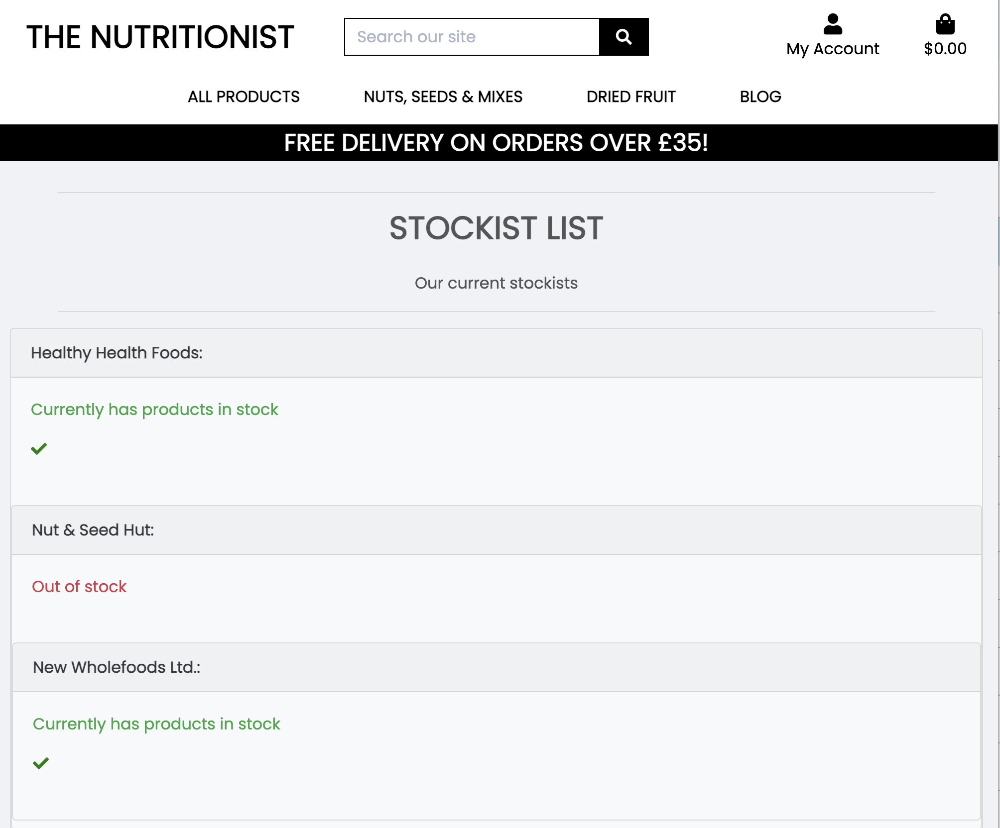

<h1 align="center">The Nutritionist Website</h1>

[View the live project here.](https://nutritionist-rf-f7d23ec1a841.herokuapp.com/)

This is the main marketing website for The Nutritionist raw organic online food store. It is designed to be responsive and accessible on a range of devices, making it easy to navigate for potential customers and users.

<h2 align="center"></h2>

## User Experience (UX)

-   ### User stories

    -   #### First Time Customer Goals

        1. As a First Time Customer, I want to easily understand the main products sold by the ecommerce company
        2. As a First Time Customer, I want to be able to easily navigate throughout the site to find products.
        3. As a First Time Customer, I want to look for reviewss to understand what their customers think of them and see if they are trusted and provide a good level of service. I also want to locate their social media links to see their followings on social media to determine how trusted and known they are.

    -   #### Returning Customer Goals

        1. As a Returning Customer, I want to explore and find new and inspiring dried fruit and nuts to buy.
        2. As a Returning Customer, I want to be able to buy products form the store and get them delivered.
        3. As a Returning Customer, I want to be able to find out more about the nutritional benefits of the products the store sells.

    -   #### Frequent Customer Goals
        1. As a Frequent Customer, I want to be able to find products easily through search options.
        2. As a Frequent Customer, I want to sign up and create my own account.
        3. As a Frequent Customer, I want to sign up to the Newsletter so that I am emailed information about any new products.

    -   #### Site Owner Goals
        1. As a Site Owner, I want the website to be attractive to customers and entice them to buy products easily.
        2. As a Site Owner, I want to establish a reular customer base who return and make regular purchases.
        3. As a Site Owner, I want products to be stocked in high street shops and keep track of stock held by partners.

## Design:

### Typography
 The Poppins font via [Google Fonts:](https://fonts.google.com/) is the main font used throughout the website with Sans Serif as the fallback font in case for any reason the font cannot be displayed in a browser correctly.

### Color Scheme:

*Palette*: **The Nutritionist**

| Brand colour | Black |
| :---: | :---: |
|  |  |
| #00474C | #000000 |  

### Wireframes
I have drawn a series of wireframes using Adobe XD to evidence responsive design planning of the site taking into account layouts for a range of device sizes (mobile, tablet and desktop views) When the mobile layout differers significantly from tablet, I have drawn an additional layout - for example the products page layout. You can see the wireframes for the product page below. For the complete set of wireframes - the files are stored [here](media/wireframes/).

### Wireframes - mobile first design
#### Mobile layout (products)

#### Tablet layout (products)

#### Desktop layout (products)

## Database
### Relational Database
This project utilises PostgreSQL, a relational database mangement system (RDBMS) managed by ElephantSQL which offers PostgreSQL as a service. 

### Models
Django includes an Object-Relational Mapping (ORM) system for working with databases. In Django, a "model" refers to a Python class that defines the structure and behaviour of a database table. Models can establish relationships with other models, such as ForeignKey, OneToOneField, and ManyToManyField, to represent associations between tables in the database.

As illustrated in the ERD, each model corresponds to a database table, and each field corresponds to a column in that table.

### Entity Relationship Diagram (ERD)

The following are the custom built models for this app:

### Blog:
The blog has functionality to add a series of posts with title, text excerpt and an image displayed on the main blog page, with a button to click through to read the whole content of the post.

#### Post Model Database Table
- id: BigAutoField
- post_title : Charfield
- slug: Slugfield
- body : Textfield
- publish_date: DateTimeField
- thumb: ImageField
- author: ForeignKey
- status: IntegerField

The Post Model also has a nested class Meta, which orders the posts in descending order according to the publish_date field. The __str__ method returns the title of the blog post as a string, so the title of each blog is listed in the admin area. 

### Stockists:
A model designed to store information added by the owner (superuser) of the ecommerce site, to lbe able to check which retailers have the company's products in stock. 

#### Stockists Model Database Table
- id: BigAutoField
- name : Charfield
- has_stock: BooleanField

### Reviews:
The Reviews model and templates are currently in development.

## Features

I have designed a series of features to meet requirements set out in user stories.

### Navigation
- Use of categories in dropdown as well as selection by rating and price.
- Search bar 
- Account and Checkout icon links to relevant pages

### Products Page
- Responsive layout of products.

### Individual Products Page
Products Modal box

### Product Management (superuser)

### Checkout Page

### Sign Up/ Login pages

### Checkout functionality

### Stripe payment option

### Transactional Email

### Blog

### Stockist page

### Responsive on all device sizes

### Interactive elements

## Technologies Used

### Front-End Technologies Used

- 
    - [HTML5](https://developer.mozilla.org/en-US/docs/Web/Guide/HTML/HTML5) - Used as the base for markup text.
- 
    - [CSS3](https://developer.mozilla.org/en-US/docs/Web/CSS/CSS3) - Used as the base for cascading styles.
- 
    - [jQuery 3.4.1](https://code.jquery.com/jquery/) - Used as the primary JavaScript functionality.
- 
    - [Bootstrap 4.6](https://getbootstrap.com/docs/4.6/getting-started/introduction/) - Used as the front-end framework for layout and design.
- 
    - [Stripe API](https://stripe.com/docs/api?lang=python) - Used to make secured payments on *The Nutritionist*.
- 
    - [Amazon AWS S3](https://aws.amazon.com/) - Used to store *staticfiles* and *media* folders and files.

### Back-End Technologies Used

- 
    - [Python 3.6.7](https://www.python.org/) - Used as the back-end programming language.
- 
    - [Django 2.2.16](https://docs.djangoproject.com/en/2.2/) - Used as my Python web framework.
- 
    - [Heroku](https://www.heroku.com) - Used for *"Platform as a Service"* (PaaS) for app hosting.
- 
    - [PostgreSQL 11.4](https://www.postgresql.org/) - Used as relational SQL database via [ElephantSQL](https://www.elephantsql.com/).

### Additional Technologies Used

1. [Google Fonts:](https://fonts.google.com/)
    - Google fonts were used to import the 'Poppins' font used on all pages throughout the project.
1. [Font Awesome:](https://fontawesome.com/)
    - Font Awesome was used on all pages throughout the website to add icons for aesthetic and UX purposes.
1. [Photoshop:](https://www.adobe.com/ie/products/photoshop.html)
    - Photoshop was used to resize images and editing photos for the website.
1. [Adobe XD:](https://en.wikipedia.org/wiki/Adobe_XD)
    - Adobe XD was used to create the [wireframes](media/wireframes/) during the design process. 
1. [Git](https://git-scm.com/)
    - Git was used for version control by utilizing the Gitpod terminal to commit to Git and Push to GitHub.
1. [GitHub:](https://github.com/)
    - GitHub was used to store the projects code after being pushed from Git.

## Testing

The W3C Markup Validator and W3C CSS Validator Services were used to validate every page of the project to ensure there were no syntax errors in the project.

-   [W3C Markup Validator](https://jigsaw.w3.org/css-validator/#validate_by_input) - [Results](https://github.com/)
-   [W3C CSS Validator](https://jigsaw.w3.org/css-validator/#validate_by_input) - [Results](https://github.com/)

### Testing User Stories from User Experience (UX) Section

-   #### First Time Visitor Goals

    1. As a First Time Visitor, I want to easily understand the main products sold by the ecommerce company

        1. Upon entering the site, users are automatically greeted with a clean and easily readable navigation bar to go to the page of their choice. Underneath there is a Hero Image with Text and a "Shop Now" Call to action button.
        2. The main visual impression of the brand is evident immediately with the hero image.

    2. As a First Time Visitor, I want to be able to easily navigate throughout the site to find products.

        1. At the top of each page there is a clean navigation bar, each link has a dropdown menu which describes what category they will end up at clearly, alternatively the left hand dropdown menu offers a selection of sort methods.
        2. Users can click on a product of interest to find out more about the product and add their chosen quantity to their basket.
        
        3. There is a Keep Shopping call to action button at the bottom of each product page to return the customer to the main product page.

    3. As a First Time Visitor, I want to look for reviews to understand what their customers think of them and see if they are trusted and provide a good level of service. I also want to locate their social media links to see their followings on social media to determine how trusted and known they are.
        1. Once the new visitor has visited individual products, the user will be able to see reviews indicating what previous buyers thought about the product.
        2. The user can also scroll to the bottom of most pages on the site to locate social media links in the footer.

-   #### Returning Visitor Goals

    1. As a Returning Visitor, I want to explore and find new and inspiring dried fruit and nuts to buy.

        1. These are clearly shown in the product layouts and individual product pages.
        2. Shoppers will be able to find out about new products when they are anounced in the blog.

    2. As a Returning Visitor, I want to be able to buy products form the store and get them delivered.

        1. The individual product pages allow users to add products to their bag.
        2. A toast message will appear to inform the user they have successfully added the product quantity to the bag.
        
        3. Users can see products listed on the shopping bag page with a total cost information on delivery threshold and a button to click through to the checkout page to purchase.
        4. Users can create an account and buy products for delivery using card payment methods.
        5. The user receives a toast message to confirm if the purchase was successful and the user will receive a confirmation emai to their email address.

    3. As a Returning Visitor, I want to be able to find out more about the nutritional benefits of the products the store sells.
        1. The Blog Page has a tab on the main navigtion and will open the main blog archive with a list of posts to read. Each post links through to the complete article on a new page.

-   #### Frequent User Goals

    1. As a Frequent User, I want to be able to find products easily through search options.

        1. The user can explore the sort methods in the drop down menu on the main navigation and sort products by price rating or category. Each sort optioin has further options such as ordering products from low - high price or alphabetically for example.
        
    2. As a Frequent User, I want to sign up and create my own account.

        1. Users can set up an account at any time. This would be more relevant to users who buy often and like the speed and convenience of ordering whilst logged into their account. They can also keep a record of past users and their delivery details are autosaved.

    3. As a Frequent User, I want to sign up to the Newsletter so that I am emailed information about any new products.
        1. At the bottom of every page there is a footer where users can find a newsletter sign-up form.
        2. To the right hand side of the footer the user can see "Subscribe to our Newsletter" and are prompted to Enter their email address.
        3. There is a "Submit" button to the right hand side of the input field which is located close to the field and can easily be distinguished.

-   #### Site Owner Goals

    1. As a Site Owner, I want the website to be attractive to customers and entice them to buy products easily.
        1. The home page displays a structured navigation with sotrting and filtering functionality, enabling shoppers to find products easily.
        2. Product pages display an image and a clear desription of the product which can be easily added to a basket which is displayed in a modal to the top right of the page. 

    2. As a Site Owner, I want to establish a reular customer base who return and make regular purchases.
        1. Customers can create their own account through the sign-up page and save their details. They can also see a list of previous purchases within the account layout
        2. The blog informs customers to recently added products and nutritional benefits of products.

    3. As a Site Owner, I want products to be stocked in high street shops and keep track of stock held by partners.
        1. The stockists app lists high street vendors who stock the Nutritionist's products.
        
        2. The shop owner/superuser can update the list manually in the admin area to indicate whether a partner has products or is out of stock. Future development would see this functionality to be developed to indicate what products are in stock and eventually into an automated inventory system.
   

### Further Testing

-   The Website was tested on Google Chrome, Internet Explorer, Microsoft Edge and Safari browsers.
-   The website was viewed on a variety of devices such as Desktop, Laptop, iPhone7, iPhone 8 & iPhoneX.
-   A large amount of testing was done to ensure that all pages were linking correctly.
-   Friends and family members were asked to review the site and documentation to point out any bugs and/or user experience issues.

### Known Bugs

-   On some mobile devices the Hero Image pushes the size of screen out more than any of the other content on the page.
    -   A white gap can be seen to the right of the footer and navigation bar as a result.
-   On Microsoft Edge and Internet Explorer Browsers, all links in Navbar are pushed upwards when hovering over them.

## Deployment

The project was deployed to Heroku and uses a relational PostgreSQl database via ElephantSQL using the following steps...

### ElephantSQL

1. Go to [ElephantSQL.com](https://www.elephantsql.com/) and click *Get a managed database today*.
2. Choose New, then from the dropdown, select *Create new app*
3. Add preferred app name, select location, then click *create app* 
4. Select Tiny Turtle via *Try now for FREE*
5. Select *Log in with GitHub* and authorize ElephantSQL with your GitHub account.
6. In the create new team form:
7. Add a *team name*. 
8. Agree to the *Terms of Service*.
9. Select *Yes* for GDPR.
10. Add email address.
11. Click *Create Team*.
12. Click *Create New Instance*.

After logging into ElephantSQL...
1. Set up your plan.
2. Name the plan (genrally the name of the project).
3. Select a region and data center (the one closest to your area).
4. Click *Review*.
5. Click *Create New Instance*.
6. Return to the dashboard and click on the *database instance name*.
7. Copy the database url.

### Heroku

1. Go to [Heroku.com](https://www.heroku.com/).
2. Choose *New*, then from the dropdown, select *Create new app*
3. Add preferred app name, select location, then click *create app* 
4. Go to the settings tab and add the DATABASE_URL config var.   
5. Select *Reveal Config Vars*.
6. Add config var DATABASE_URL and paste in the ElephantSQL database URL as the value.
7. Add config var DATABASE_URL and paste in the ElephantSQL database URL as the value.
8. Connect external database to GitPod as follows:
9. In the **env.py** file add a new key, **DATABASE_URL** then give it the value of the database URL (see config vars Heroku).
10. Install **dj-database-url** package version 0.5.0 and **psycopg2** in the terminal.
11. Type *pip3 freeze --local > requirements.txt* to add the packages to the requirements.txt file.
12. In settings.py file, comment out the default database setting and replace with the DATABASE_URL environment variable.
13. Run *showmigrations* command in the terminal in order to confirm connection to the external database and view the list of migrations which should have been made, then run the *migrate* command.
14. Create a superuser for the new database.

### Deploying to Heroku

1. Install gunicorn which will act as our webserver and freeze that into the requirements.txt file
2. Create a Procfile in the root directory to tell Heroku to create a web dyno which will run gunicorn and serve our Django app.
3. Temporarily disable collectstatic by logging into the Heroku CLI in the terminal to tell Heroku not to collect static files when deploying:
4. Add the hostname of our Heroku app to allowed hosts in settings.py.
5. Commit changes and push to GitHub.
6. Use the command *git push Heroku main* to deploy to Heroku.

## Credits
[Tim Nelson](https://github.com/TravelTimN/ci-milestone05-fsfw/blob/main/README.md?plain=1) - icons for technologies used in Readme.md

### Code

-   The full-screen hero image code came from this [StackOverflow post](https://stackoverflow.com)

-   [Bootstrap4](https://getbootstrap.com/docs/4.4/getting-started/introduction/): Bootstrap Library used throughout the project mainly to make site responsive using the Bootstrap Grid System.

-   [MDN Web Docs](https://developer.mozilla.org/) : For Pattern Validation code. Code was modified to better fit my needs and to match an Irish phone number layout to ensure correct validation. Tutorial Found [Here](https://developer.mozilla.org/en-US/docs/Web/HTML/Element/input/tel#Pattern_validation)

### Content

-   All content was written by the developer.

-   Psychological properties of colours text in the README.md was found [here](http://www.colour-affects.co.uk/psychological-properties-of-colours)

### Media

-   All Images were created by the developer.

### Acknowledgements

-   My Mentor for continuous helpful feedback.

-   Tutor support at Code Institute for their support.