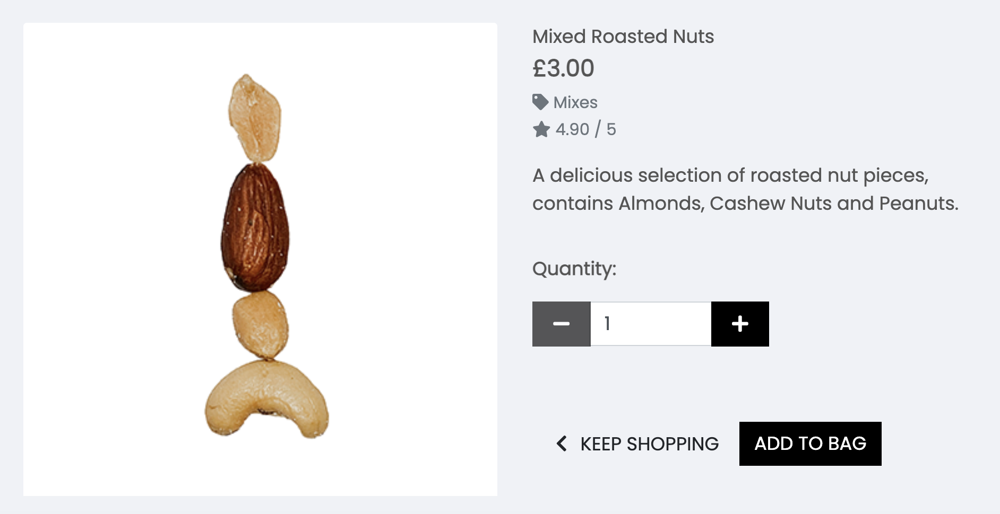
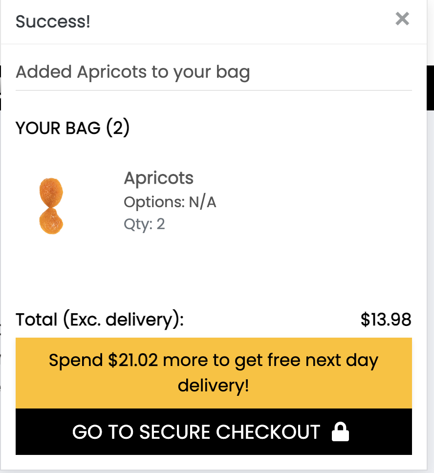
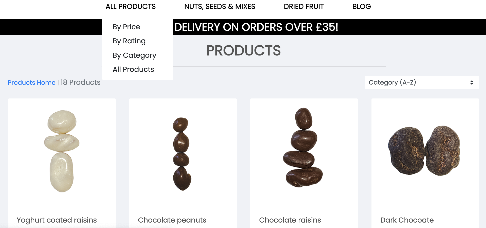
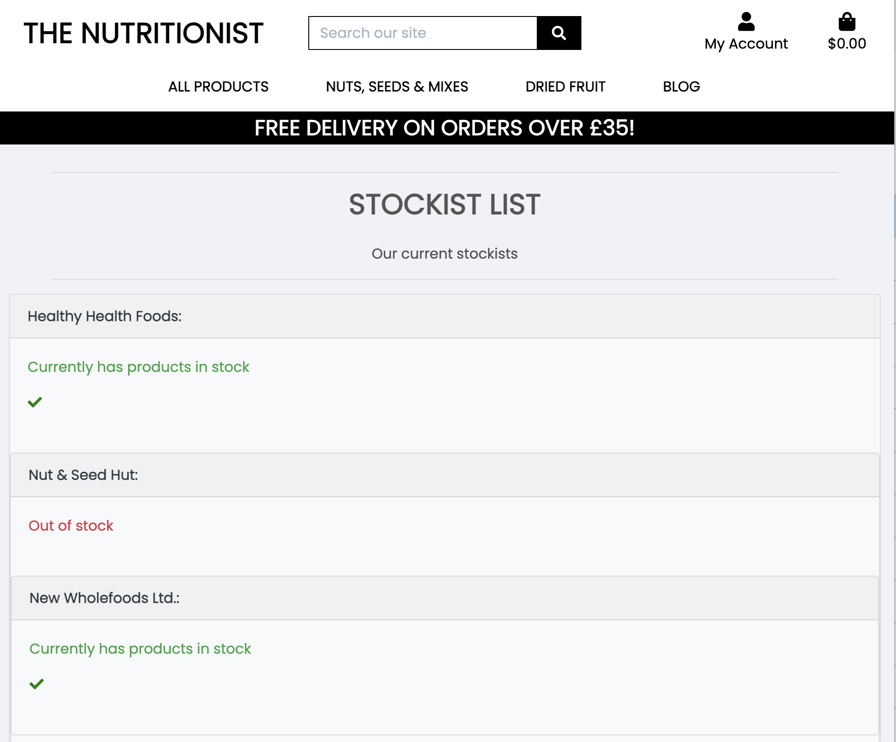
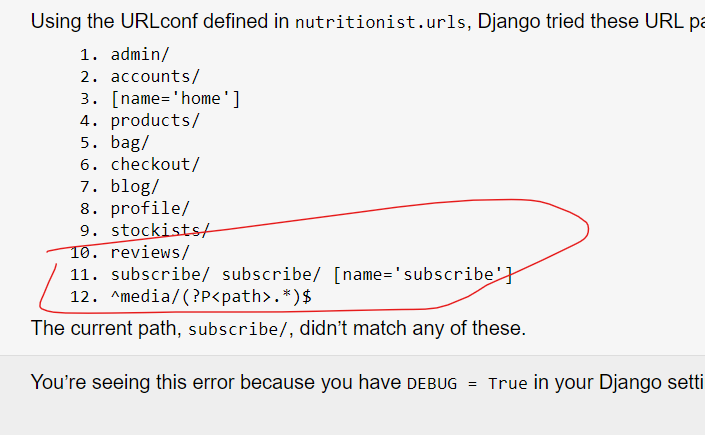
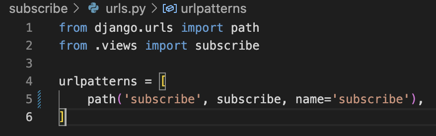

## TESTING

## TABLE OF CONTENTS

* [Validation](#validation)
    * [HTML Validation](#html-validation)
    * [CSS Validation](#css-validation)
    * [JavaScript Validation](#javascript-validation)
    * [Python Validation](#python-validation)
    * [Lighthouse Report](#lighthouse-report)
    * [Responsive and Browser Testing](#responsive-and=browser-testing)
    * [Testing User Stories](#testing-user-stories)
    * [Manual Testing](#manual-testing)
    * [Bugs and Error checking](#bugs-and-error-checking)
    * [Solved Bugs](#solved-bugs)
    * [Known Bugs](#known-bugs)

## Validation

### HTML Validation

The W3C Markup Validator and W3C CSS Validator Services were used to validate every page of the project to ensure there were no syntax errors in the project.

-   [W3C Markup Validator](https://jigsaw.w3.org/css-validator/#validate_by_input) - [Results](https://github.com/)
-   [W3C CSS Validator](https://jigsaw.w3.org/css-validator/#validate_by_input) - [Results](https://github.com/)

### CSS Validation

The W3C Markup Validator and W3C CSS Validator Services were used to validate every page of the project to ensure there were no syntax errors in the project.

-   [W3C Markup Validator](https://jigsaw.w3.org/css-validator/#validate_by_input) - [Results](https://github.com/)
-   [W3C CSS Validator](https://jigsaw.w3.org/css-validator/#validate_by_input) - [Results](https://github.com/)

### JavaScript Validation

The W3C Markup Validator and W3C CSS Validator Services were used to validate every page of the project to ensure there were no syntax errors in the project.

-   [W3C Markup Validator](https://jigsaw.w3.org/css-validator/#validate_by_input) - [Results](https://github.com/)
-   [W3C CSS Validator](https://jigsaw.w3.org/css-validator/#validate_by_input) - [Results](https://github.com/)

### Python Validation

The W3C Markup Validator and W3C CSS Validator Services were used to validate every page of the project to ensure there were no syntax errors in the project.

-   [W3C Markup Validator](https://jigsaw.w3.org/css-validator/#validate_by_input) - [Results](https://github.com/)
-   [W3C CSS Validator](https://jigsaw.w3.org/css-validator/#validate_by_input) - [Results](https://github.com/)

### Lighthouse Report

### Responsive and Browser Testing

-   The Website was tested on Google Chrome, Internet Explorer, Microsoft Edge and Safari browsers.
-   The website was viewed on a variety of devices such as Desktop, Laptop, iPhone7, iPhone 8 & iPhoneX.

### Testing User Stories

-   #### First Time Visitor Goals

    1. As a First Time Visitor, I want to easily understand the main products sold by the ecommerce company

        1. Upon entering the site, users are automatically greeted with a clean and easily readable navigation bar to go to the page of their choice. Underneath there is a Hero Image with Text and a "Shop Now" Call to action button.
        2. The main visual impression of the brand is evident immediately with the hero image.

    2. As a First Time Visitor, I want to be able to easily navigate throughout the site to find products.

        1. At the top of each page there is a clean navigation bar, each link has a dropdown menu which describes what category they will end up at clearly, alternatively the left hand dropdown menu offers a selection of sort methods.
        2. Users can click on a product of interest to find out more about the product and add their chosen quantity to their basket.
        
        3. There is a Keep Shopping call to action button at the bottom of each product page to return the customer to the main product page.

    3. As a First Time Visitor, I want to look for reviews to understand what their customers think of them and see if they are trusted and provide a good level of service. I also want to locate their social media links to see their followings on social media to determine how trusted and known they are.
        1. Once the new visitor has visited individual products, the user will be able to see reviews indicating what previous buyers thought about the product.
        2. The user can also scroll to the bottom of most pages on the site to locate social media links in the footer.

-   #### Returning Visitor Goals

    1. As a Returning Visitor, I want to explore and find new and inspiring dried fruit and nuts to buy.

        1. These are clearly shown in the product layouts and individual product pages.
        2. Shoppers will be able to find out about new products when they are anounced in the blog.

    2. As a Returning Visitor, I want to be able to buy products form the store and get them delivered.

        1. The individual product pages allow users to add products to their bag.
        2. A toast message will appear to inform the user they have successfully added the product quantity to the bag.
        
        3. Users can see products listed on the shopping bag page with a total cost information on delivery threshold and a button to click through to the checkout page to purchase.
        4. Users can create an account and buy products for delivery using card payment methods.
        5. The user receives a toast message to confirm if the purchase was successful and the user will receive a confirmation emai to their email address.

    3. As a Returning Visitor, I want to be able to find out more about the nutritional benefits of the products the store sells.
        1. The Blog Page has a tab on the main navigtion and will open the main blog archive with a list of posts to read. Each post links through to the complete article on a new page.

-   #### Frequent User Goals

    1. As a Frequent User, I want to be able to find products easily through search options.

        1. The user can explore the sort methods in the drop down menu on the main navigation and sort products by price rating or category. Each sort optioin has further options such as ordering products from low - high price or alphabetically for example.
        
    2. As a Frequent User, I want to sign up and create my own account.

        1. Users can set up an account at any time. This would be more relevant to users who buy often and like the speed and convenience of ordering whilst logged into their account. They can also keep a record of past users and their delivery details are autosaved.

    3. As a Frequent User, I want to sign up to the Newsletter so that I am emailed information about any new products.
        1. Via the main navigation users can visit the page with a newsletter sign-up form.
        2. The user can see a form with a name and email field with associated text enticing the user to sign up and the benefits they will recieve by doing so. 
        3. There is a "Submit" button to the right hand side of the input fields which can easily be distinguished.

-   #### Site Owner Goals

    1. As a Site Owner, I want the website to be attractive to customers and entice them to buy products easily.
        1. The home page displays a structured navigation with sotrting and filtering functionality, enabling shoppers to find products easily.
        2. Product pages display an image and a clear desription of the product which can be easily added to a basket which is displayed in a modal to the top right of the page. 

    2. As a Site Owner, I want to establish a reular customer base who return and make regular purchases.
        1. Customers can create their own account through the sign-up page and save their details. They can also see a list of previous purchases within the account layout
        2. The blog informs customers to recently added products and nutritional benefits of products.

    3. As a Site Owner, I want products to be stocked in high street shops and keep track of stock held by partners.
        1. The stockists app lists high street vendors who stock the Nutritionist's products.
        
        2. The shop owner/superuser can update the list manually in the admin area to indicate whether a partner has products or is out of stock. Future development would see this functionality to be developed to indicate what products are in stock and eventually into an automated inventory system.

### Manual Testing
| **TEST** | **TEST DETAILS** | **EXPECTED RESULTS** | **ACTUAL RESULTS** | **PASS/FAIL** | **EVIDENCE**
| :-- | :-- | :-- | :-- | :-- | :-- |
| **TOP HEADER LINKS** |  |  |  |  | [desktop](./documentation/#.png), [tablet](./documentation/#.png), [mobile](./documentation/#.png) |
| 1 | Access URL https://nutritionist-rf-f7d23ec1a841.herokuapp.com/ |Site shows home page including Nav & Search Bar, Account, site content & footer | As Expected | Pass |
| 2 | Click Nutritionist Logo | Site shows home page | As expected | Pass |
| 3 | Search bar | Error msg appears if nothing entered in search bar and produt page displays  | As Expected  | Pass |
| 4 | Search bar - product search | Return correct results whether search term appears in product name or product description  | As Expected  | Pass |
| 5 | Account login icon | Click account icon shows login/Register dropdown menu | As Expected  | Pass |
| 6 | Dropdown Register menu item | Dropdown Register menu item  | As Expected  | Pass |
| 7 | Dropdown Login menu item | Click Login menu item goes to Login page  | As Expected  | Pass |
| 8 | Bag icon | Click Bag icon takes user to bag page | As Expected  | Pass |
| **MAIN NAV LINKS** |  |  |  |  | [desktop](./documentation/#.png), [tablet](./documentation/#.png), [mobile](./documentation/#.png) |
| 9 | Products menu item | Click All Products menu icon shows drop down with price/rating or all products options | As Expected  | Pass |
| 10 | Dropdown price menu item | Click Price dropdown menu item goes to product sorted by price | As Expected  | Pass |
| 11 | Dropdown Rating menu icon | Click Rating dropdown menu item goes to product page sorted by rating | As Expected  | Pass |
| 12 | Dropdown all products shows menu item | Click all products dropdown goes to product page | As Expected  | Pass |
| 13 | Nuts, seed & mixes menu item  | Click All products menu icon shows drop down with Nuts Seeds, Mixes or all nuts, seeds % mixes options | As Expected  | Pass |
| 14 | Dropdown nuts menu item | Click Nuts dropdown menu item goes to product page displaying Nuts category | As Expected  | Pass |
| 15 | Dropdown seeds menu item | Click Seeds dropdown menu item goes to product page displaying Seeds category | As Expected  | Pass |
| 16 | Dropdown mixes menu item | Click Mixes dropdown menu item goes to product page displaying Mixes category | As Expected  | Pass |
| 17 | Dropdown all nuts, seeds & mixes menu item | Click Nuts dropdown menu item goes to product page displaying all nuts, seeds & mixes categories | As Expected  | Pass |
| 18 | Dried Fruit menu item | Click Dried Fruit  menu icon shows drop down withFruits & Berries, Coated fruits, All dried fruit options | As Expected  | Pass |
| 19 | Dropdown Fruits & Berries menu item  | Click Fruits & Berries dropdown menu item goes to product page displaying Fruits & Beries category | As Expected  | Pass |
| 20 | Dropdown Coated Fruits menu item  | Click Coated Fruits dropdown menu item goes to product page displaying Coated Fruitss category | As Expected  | Pass |
| 21 | Dropdown All Dried Fruit menu item   | Click All Dried Fruit menu item dropdown menu item goes to product page displaying All dried fruit categories | As Expected  | Pass |
| 22 | Blog menu item | Click Blog menu item goes to Blog page | As Expected  | Pass |
| 8 | Newsletter menu item | Click Newsletter menu item goes to Newsletter page | As Expected  | Pass |
| **FOOTER LINKS** |  |  |  |  | [desktop](./documentation/#.png), [tablet](./documentation/#.png), [mobile](./documentation/#.png)  |
| 23 | Stockists button | Click Stockists button goes to Stockists page | As Expected  | Pass |
| **USER PROFILE SETUP** |  |  |  |  | [desktop](./documentation/#.png), [tablet](./documentation/#.png), [mobile](./documentation/#.png) |
| 7 | Shopper |Gain inspiration about products and brand | Owner can add blog...| UUser can access all pages via the dropdowns, the links in the footer and view bag via the basket icon |
| **NEWSLETTER SIGN UP** |  |  |  |  |  |
| 8 | Shopper |Provide inspiration about products and brand | Owner can add blog...| UUser can access all pages via the dropdowns, the links in the footer and view bag via the basket icon | [desktop](./documentation/#.png), [tablet](./documentation/#.png), [mobile](./documentation/#.png) |
| **BLOG FEATURE** |  |  |  |  |  |
| 9 | Shopper |Provide inspiration about products and brand | Owner can add blog...| UUser can access all pages via the dropdowns, the links in the footer and view bag via the basket icon | [desktop](./documentation/#.png), [tablet](./documentation/#.png), [mobile](./documentation/#.png) |

### Bugs and Error testing

-   A large amount of testing was done to ensure that all pages were linking correctly.
-   Friends and family members were asked to review the site and documentation to point out any bugs and/or user experience issues.

### Solved Bugs
- I had two paths for the Subscribe App. The path in the Subscribe app urls.py should have been empty rather entered as 'subscribe' , the result being two paths to the Nutritionist urls.py file and one of them could not be identified by Django causing an error.

### Known Bugs

-   sorting products

- When a user signs up for a newsltter and already has items already in the basket - the apperance of the success message appears as if it is part of the products modal.